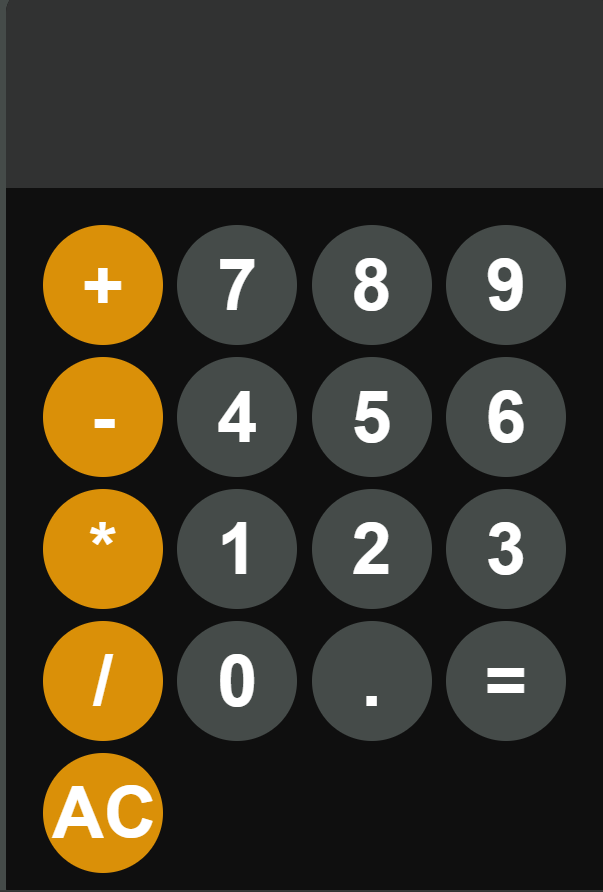

# 🔢 Calculator App

A simple calculator built using **HTML**, **CSS**, and **JavaScript**.

## ✨ Features

- Basic arithmetic operations: Addition, Subtraction, Multiplication, Division
- Clear button to reset
- Responsive layout

## 🖼️ Screenshot

